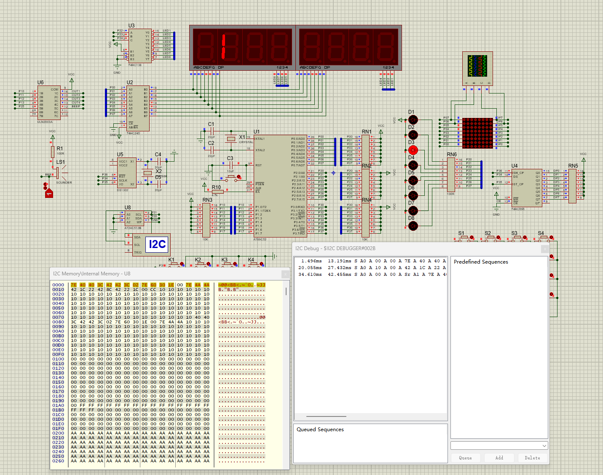
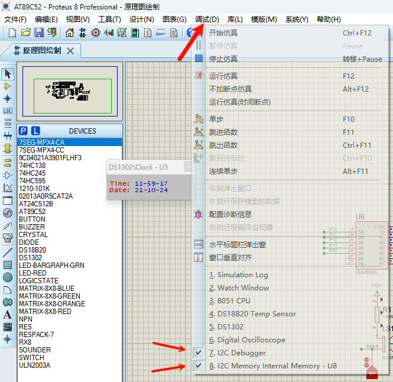

# Proteus 的 STC89C52RC 部分功能仿真

## 文件结构

```
D:.
│  .clang-format
│  .gitignore
│  AT89C52_Simulation.code-workspace
│  README.md
│
│
├─51头文件   // STC89C5x头文件
│      STC89C5xRC.H
│      STC89C5xRC.INC
│
├─doc_files  // 文档文件及附件
│      Clip_2024-10-18_01-07-56.png
│      Clip_2024-10-21_12-00-28.png
│      Clip_2024-10-21_12-04-03.png
│      Cupid.bmp
│      love.bmp
│      love.txt
│
├─proteus
│  │  AT89C52.pdsprj  // Proteus项目文件
│
├─src     // 代码
│  │  main.c    // 主代码
│  │
│  ├─App
│  ├─Com
│  │      Com_Util.c
│  │      Com_Util.h
│  │
│  ├─Dri    // 驱动代码
│  │      Dri_IIC.c
│  │      Dri_IIC.h
│  │      Dri_Timer0.c
│  │      Dri_Timer0.h
│  │      Dri_UART.c
│  │      Dri_UART.h
│  │
│  ├─Int     //外部硬件控制代码
│  │      Int_Buzzer.c
│  │      Int_Buzzer.h
│  │      Int_DigitalTube.c
│  │      Int_DigitalTube.h
│  │      Int_EEPROM.c
│  │      Int_EEPROM.h
│  │      Int_Key.c
│  │      Int_Key.h
│  │      Int_Key_Matrix.c
│  │      Int_Key_Matrix.h
│  │      Int_LED.c
│  │      Int_LED.h
│  │      Int_LEDMatrix.c
│  │      Int_LEDMatrix.h
│  │
│  └─Mid
└─tools
        stcflash.py
```

## 新增 IIC 调试



运行后调试



[GitHub 链接](https://github.com/Alddp/AT89C52_Simulation)
